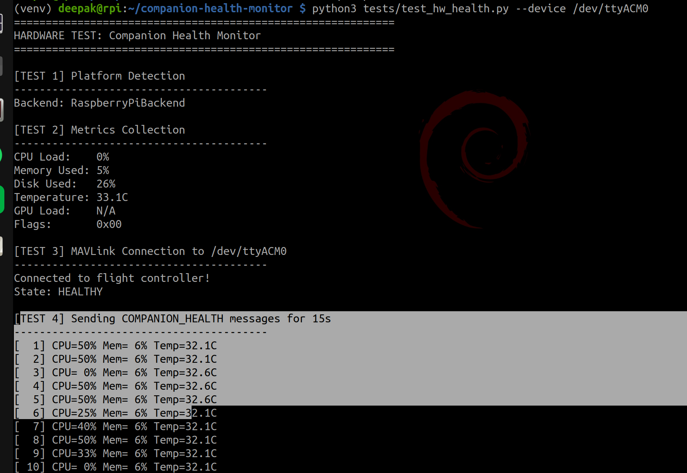
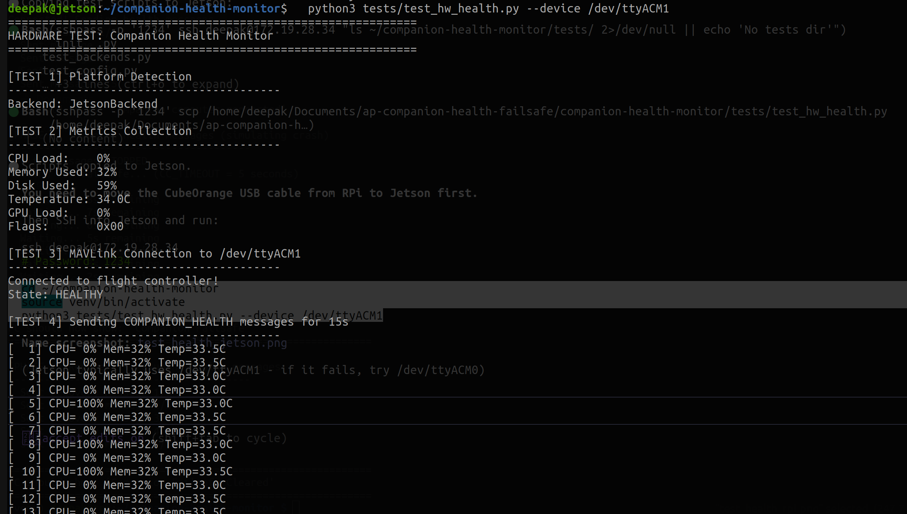

# Companion Computer Health Monitor

MAVLink-based health monitoring for ArduPilot companion computers. Sends health metrics to the flight controller and triggers failsafe on timeout.

## Hardware Testing

Tested on real hardware with CubeOrange flight controller:

### Raspberry Pi 4


### Jetson Nano


## Features

- Cross-platform: Raspberry Pi, Jetson Nano/Xavier/Orin, generic Linux
- Auto-detection of platform for optimized metrics collection
- Configurable via YAML or command line
- Sends COMPANION_HEALTH message (ID 11061) at 1 Hz

## Quick Start

```bash
# Clone
git clone https://github.com/deepak61296/ap-companion-health-monitor-failsafe.git
cd ap-companion-health-monitor-failsafe

# Setup
python3 -m venv venv
source venv/bin/activate
pip install -r requirements.txt

# Run (USB connection)
python3 health_monitor.py --device /dev/ttyACM0 --verbose
```

## Usage

```bash
# USB connection
python3 health_monitor.py --device /dev/ttyACM0 --verbose

# UDP (for SITL)
python3 health_monitor.py --device udpout:127.0.0.1:14560 --verbose

# With config file
python3 health_monitor.py --config config.yaml
```

## Configuration

Copy `config.yaml.example` to `config.yaml`:

```yaml
connection:
  device: "/dev/ttyACM0"
  baud: 115200

monitoring:
  rate_hz: 1.0

thresholds:
  temp_throttle: 80.0
  temp_overheat: 85.0
  memory_low: 90
  disk_low: 95
```

## Flight Controller Setup

Requires custom ArduPilot firmware with AP_CompanionHealth library.

Parameters:
- `CCH_ENABLE`: Set to 1 to enable companion health monitoring
- `CCH_TIMEOUT`: Seconds before failsafe triggers (default 5)

## COMPANION_HEALTH Message

| Field | Type | Description |
|-------|------|-------------|
| cpu_load | uint8 | CPU usage 0-100% |
| memory_used | uint8 | RAM usage 0-100% |
| disk_used | uint8 | Disk usage 0-100% |
| temperature | int16 | Temp in decidegrees (450 = 45.0C) |
| gpu_load | uint8 | GPU 0-100%, or 255 if N/A |
| status_flags | uint8 | Health flags bitmask |
| watchdog_seq | uint16 | Sequence counter |

## Project Structure

```
companion-health-monitor/
├── health_monitor.py       # Main entry point
├── config.yaml.example     # Example config
├── companion_health/       # Core package
│   ├── config.py          # Config loader
│   ├── monitor.py         # HealthMonitor class
│   ├── state.py           # State machine
│   └── backends/          # Platform-specific metrics
│       ├── generic.py     # Linux /proc
│       ├── raspberry_pi.py # vcgencmd
│       └── jetson.py      # tegrastats/sysfs
├── tests/                  # Test suite
└── screenshots/            # Hardware test evidence
```

## Current Status

This is part of GSoC 2026: Companion Computer Health Monitoring.

**Working:**
- Health message sending to FC
- Platform detection (RPi, Jetson, generic)
- Failsafe trigger on timeout
- Failsafe recovery when messages resume
- Tested on real hardware

**TODO:**
- Services monitoring (track specific processes)
- Hardware watchdog integration
- DataFlash logging on FC
- ArduPlane/Rover/Sub support
- MAVLink upstream submission

## Related

- ArduPilot fork with FC code: [deepak61296/ardupilot](https://github.com/deepak61296/ardupilot) (branch: companion-computer-health-monitor)

## License

GPLv3
