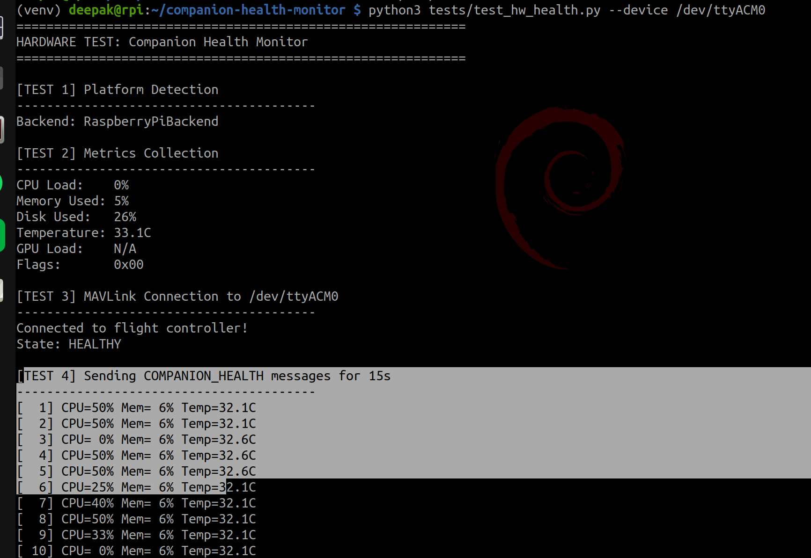
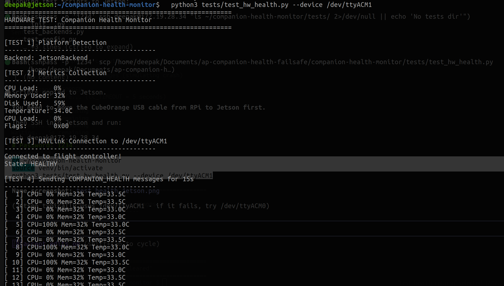

# Companion Computer Health Monitor

Sends health telemetry from companion computers (RPi, Jetson, etc.) to ArduPilot. The flight controller triggers failsafe if the companion stops responding or reports critical issues.

**GSoC 2026 Project** | ArduPilot | Mentor: Jaime Machuca

## Demo

<a href="https://www.youtube.com/watch?v=s6RZwZTwf14">
  
</a>

Click to watch - shows qgc showing companion health messages

## Hardware Tests

Tested with CubeOrange flight controller:

**Raspberry Pi 4**


**Jetson Nano**


## CURRENT PROGRESS

I have built a working implementation (v0.1) before GSoC that demonstrates end-to-end
functionality. The FC library receives health messages, tracks state, and triggers failsafe on
timeout. The companion script collects metrics and sends them over MAVLink. Hardware
tests on Raspberry Pi 4 and Jetson Nano with Cube Orange confirm the system works on
real hardware. Demo videos and All Progress will be added to the README of the repository
given below (Companion Repository).

Also here is a demo video of working v0.1

During GSoC, everything will be properly reviewed with mentors, refactored based on
feedback, and tested thoroughly and will discusses about edge cases with mentor.

### Repositories

| Repository | Description |
|------------|-------------|
| ArduPilot fork | FC library on branch `companion-computer-health-monitor` |
| Companion Repository | Actual health monitor code that will run on Companion |

### Pre-GSoC Implementation v0.1 (Complete)

| Component | Files / Details |
|-----------|-----------------|
| MAVLink message (local) | `ardupilotmega.xml` - `COMPANION_HEALTH` message |
| FC: Message handling | `AP_CompanionHealth.cpp` - receive and store metrics |
| FC: Timeout failsafe | `AP_CompanionHealth.cpp` - basic timeout detection |
| FC: Parameters | `CCH_ENABLE`, `CCH_TIMEOUT` in `AP_CompanionHealth.h` |
| FC: Copter integration | `ArduCopter/Copter.h`, `events.cpp` |
| FC: GCS messages | Status text via `GCS_SEND_TEXT()` |
| Companion: Metrics | `health_monitor.py` - CPU, memory, temperature |
| Companion: Platforms | `platforms/` - RPi, Jetson, Generic backends |
| Companion: Config | `config.yaml` parsing |
| Testing: SITL | Basic timeout test |
| Testing: Hardware | RPi4 + CubeOrange (USB), Jetson + CubeOrange (USB) |

### GSoC Work (To Do)

| Task | Files to Create / Modify |
|------|--------------------------|
| review and finalize architecture with mentor | Refactor `AP_CompanionHealth.cpp` based on feedback |
| `services_status` check | `AP_CompanionHealth.cpp` - add bitmask logic |
| `CCH_SVC_MASK` parameter | `AP_CompanionHealth.h` - new parameter |
| Watchdog stall detection | `AP_CompanionHealth.cpp` - compare seq values |
| DataFlash logging | `AP_Logger/LogStructure.h`, `Write_CCH()` function |
| Arming check | `AP_Arming.cpp` - optional block if `CCH_ENABLE != 0` and companion state is `DISCONNECTED` or `CRITICAL` |
| Services monitoring | `health_monitor.py` - `ServicesMonitor` class |
| Spike filtering | `health_monitor.py` - `collections.deque` filter |
| Auto-reconnect | `health_monitor.py` - exponential backoff |
| systemd service | `systemd/health_monitor.service` |
| Installer script | `setup.sh` |
| Docker support | `Dockerfile`, `docker-compose.yml` |
| ArduPlane integration | `ArduPlane/events.cpp`, `Parameters.cpp` |
| ArduRover integration | `Rover/failsafe.cpp`, `Parameters.cpp` |
| SITL test suite | `Tools/autotest/test_companion_health.py` |
| CI integration | GitHub Actions workflow |
| MAVLink PR | Submit initial MAVLink PR to `mavlink/mavlink` by midterm and iterate based on mentor and community feedback |
| Wiki documentation | ArduPilot wiki pages |

### Future Scope

I will continue maintaining this project beyond GSoC and plan to test it with other
companion computer based previous year GSoC projects in ArduPilot.

Additional platform backends - if i get more newer hardware after GSoC. I will
continue to add support for newer boards like Arduino Uno Q, Arduino Ventuno Q
and more upcoming Single Board Computers.

MAVSDK-based implementation - The companion script uses `pymavlink`, which is
lightweight. For resource-constrained boards, a C++ implementation using MAVSDK
could offer better performance. This would be a separate implementation, not a
replacement.

## Timeline

| Period | Dates | Work |
|--------|-------|------|
| Community Bonding | May 1-24 | Code review with mentor |
| Week 1-2 | May 25 - Jun 7 | Services monitoring, watchdog |
| Week 3-4 | Jun 8-21 | Logging, arming check |
| Week 5-6 | Jun 22 - Jul 5 | Script improvements |
| Midterm | Jul 6-10 | Evaluation |
| Week 7-8 | Jul 11-19 | SITL tests, CI |
| Week 9-10 | Jul 20 - Aug 2 | Plane/Rover support |
| Week 11-12 | Aug 3-16 | MAVLink PR, docs |
| Final | Aug 17-24 | Final evaluation |

## Quick Start

```bash
# Clone and install
git clone https://github.com/deepak61296/ap-companion-health-monitor-failsafe.git
cd ap-companion-health-monitor-failsafe
pip install -e .

# SITL testing
python -m companion_health --device udpout:127.0.0.1:14560 -v

# Hardware (USB)
python -m companion_health --device /dev/ttyACM0 -v

# With config file
python -m companion_health --config config/sitl.yaml -v
```

## Project Structure

```
companion-health-monitor/
├── src/companion_health/     # Main package
│   ├── cli.py                # Command-line interface
│   ├── monitor.py            # HealthMonitor class
│   ├── state.py              # State machine
│   ├── config.py             # Configuration
│   ├── mavlink.py            # MAVLink constants
│   ├── backends/             # Platform backends
│   └── services/             # Services monitoring (GSoC)
├── tests/                    # Test suite
│   ├── unit/                 # Fast unit tests
│   └── integration/          # SITL/hardware tests
├── config/                   # Example configs
├── deploy/                   # Docker, systemd
└── pyproject.toml            # Python packaging
```

## FC Parameters

- `CCH_ENABLE` - 0=off, 1=RTL, 2=Continue, 3=SmartRTL, 4=SmartRTL/Land, 5=Land
- `CCH_TIMEOUT` - seconds before failsafe (default 5)

## Message Format

COMPANION_HEALTH (ID 11061, 13 bytes):
- `cpu_load`, `memory_used`, `disk_used` - 0-100%
- `temperature` - decidegrees (450 = 45.0C)
- `gpu_load` - 0-100% or 255 if N/A
- `services_status` - bitmask of running services
- `watchdog_seq` - counter to detect stalls
- `status_flags` - warning flags

## Platforms

Auto-detects and uses optimized backend:
- **Raspberry Pi** - vcgencmd for temp, throttle detection
- **Jetson** - tegrastats for GPU, thermal zones
- **Generic Linux** - psutil + sysfs

## Development

```bash
# Install with dev dependencies
pip install -e ".[dev]"

# Run tests
pytest tests/unit/ -v

# Run linter
flake8 src/
```

## Related

- [ArduPilot fork](https://github.com/deepak61296/ardupilot/tree/companion-computer-health-monitor) - FC library
- [Demo video](https://www.youtube.com/watch?v=s6RZwZTwf14)

## License

GPLv3
