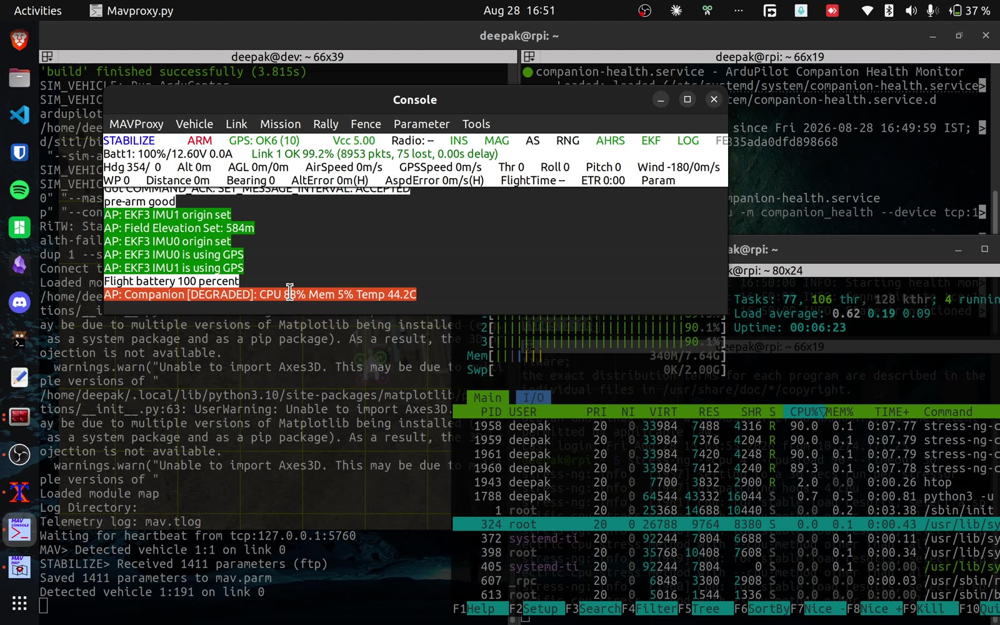
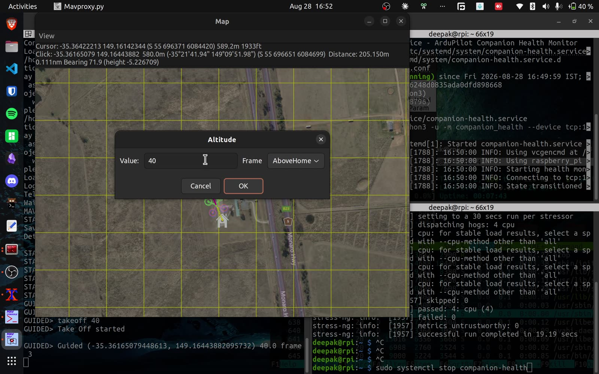
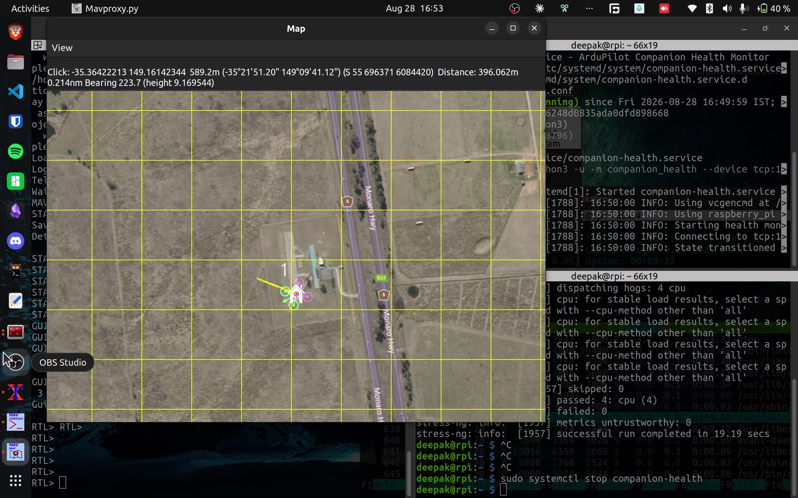

# Demo walkthrough

The demo runs ArduCopter SITL on a laptop with the companion monitor on a real
Raspberry Pi 4, connected over WiFi. The Pi is not simulated. It sends real
metrics from its own sensors, and the load you see is real load generated with
stress-ng.

[Watch the video](https://www.youtube.com/watch?v=GweYXp5yXuU).

## What happens

1. The monitor connects and the flight controller announces
   `Companion computer connected` followed by `Companion [HEALTHY]`.

2. stress-ng pushes the Pi to 90 percent CPU. The FC classifies the raw
   numbers itself and reports `Companion [DEGRADED]`. Nothing else happens.
   Degraded is a warning, not a failsafe, so a load spike cannot take the
   vehicle out of the sky. htop on the Pi shows the four workers at 90
   percent while the message is on screen.



3. The load passes and the FC reports `Companion [HEALTHY]` again.

4. The copter takes off in GUIDED and flies to a map point a few hundred
   meters out, a stand-in for any real companion-driven mission.



5. Mid flight, the companion service is stopped. That is the crash. Five
   seconds later (`CCH_TIMEOUT`) the FC prints `Companion Failsafe`, switches
   to RTL and flies home.



## A note on one console line

MAVProxy prints `Arming checks disabled` when the copter arms. That message
is wrong. It comes from MAVProxy looking up the old `ARMING_CHECK` parameter
name, which current ArduPilot master renamed to `ARMING_SKIPCHK`, so the
lookup fails and MAVProxy assumes the worst. In the demo `ARMING_SKIPCHK` is
0, every arming check is enabled, and the firmware's own warning for disabled
checks never appears.

## Reproducing it

Flight controller side: build and run SITL from the `companion-health`
branch. Companion side: any Linux machine works, but use something with
sane thermals. The monitor reports real temperatures, and a hot laptop will
genuinely trip the overheat thresholds (ask us how we know).

```bash
# laptop: SITL from the ardupilot fork
./Tools/autotest/sim_vehicle.py -v ArduCopter --console --map

# companion: point the monitor at the SITL TCP serial port
python -m companion_health --device tcp:LAPTOP_IP:5762 -v

# generate load on the companion
stress-ng --cpu 4 --cpu-load 90 --timeout 30

# kill and restore the companion (as a systemd service)
sudo systemctl stop companion-health
sudo systemctl start companion-health
```

Set `CCH_ENABLE` to 1 and `CCH_TIMEOUT` to 5 on the FC first (or `CCH_ENABLE`
to -1, Warn only, to watch without giving the failsafe any authority). See
[mission-planner.md](mission-planner.md) for doing that from a GCS.
